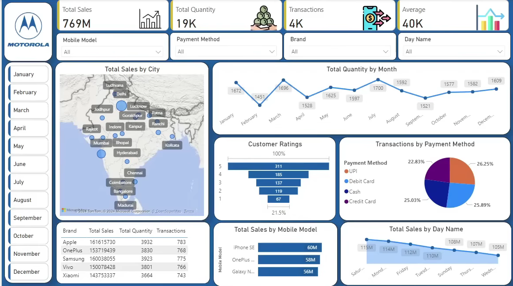

# Motorola Mobile Sales Dashboard

## Project Overview

This project is an interactive Power BI dashboard developed to analyze
mobile phone sales performance and customer transaction data.

The dashboard provides a high-level view of sales, quantity sold,
transactions, customer ratings, payment methods, brands, mobile models,
cities, months, and days of the week.

## Objectives

- Analyze overall sales performance
- Identify sales trends across months
- Compare brand performance
- Analyze customer ratings
- Understand preferred payment methods
- Identify high-performing mobile models
- Analyze city-wise sales performance
- Compare sales across different days of the week

## Key KPIs

- Total Sales
- Total Quantity
- Total Transactions
- Average Sales

## Dashboard Features

- Sales by City
- Quantity by Month
- Customer Ratings
- Transactions by Payment Method
- Sales by Mobile Model
- Sales by Day Name
- Brand-wise sales and transaction comparison
- Filters for month, mobile model, payment method, brand, and day

## Tools Used

- Microsoft Power BI
- Microsoft Excel
- Data Visualization
- Data Analysis
- Dashboard Design

## Dashboard Preview



## Project Structure

```text
motorola-mobile-sales-powerbi/
│
├── README.md
│
├── PowerBI/
│   └── Mobile_Sales_Dashboard.pbix
│
├── Dashboard/
│   └── Mobile_Sales_Dashboard.png
│
└── Data/
    ├── January_24.xlsx
    ├── February_24.xlsx
    ├── March_24.xlsx
    ├── April_24.xlsx
    └── Other_Data.xlsx
